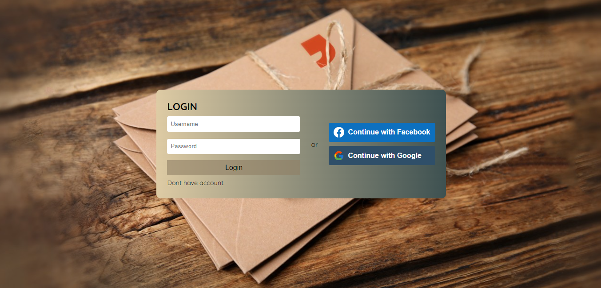
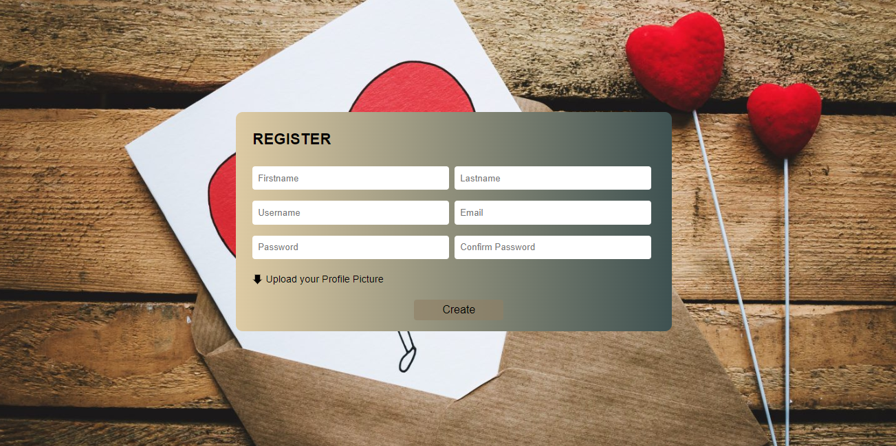
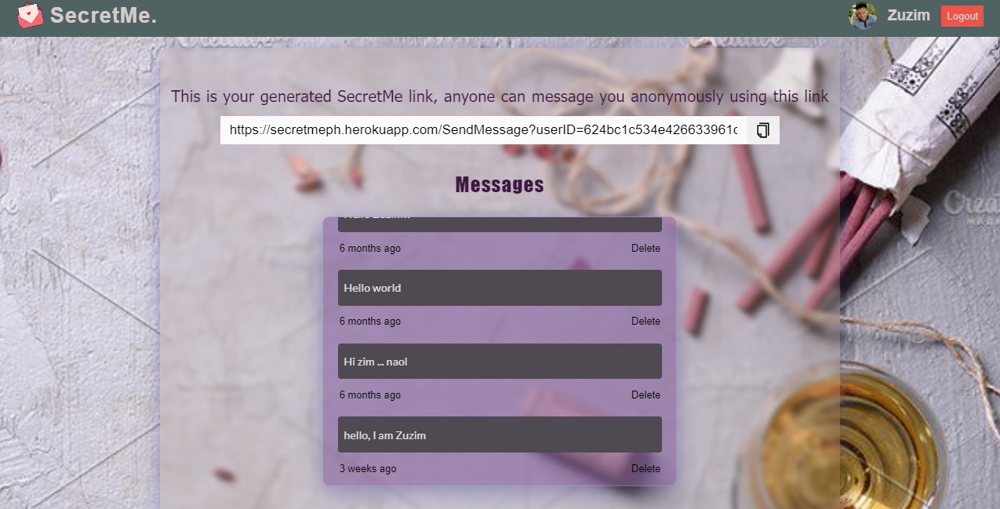
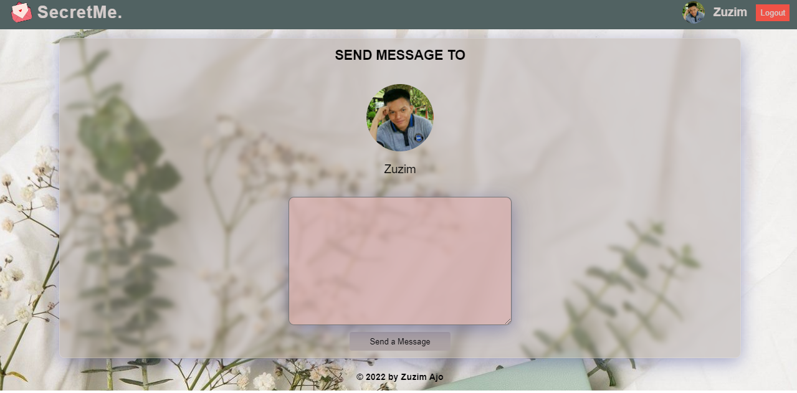

<h1 align="center"><a href='https://secretmeph.herokuapp.com/login' target='_blank' rel='noreferrer'>SecretMe</a></h1>

<h2 align="center">SecretMe is the web app that allows the users to send messages anonymously.</h2>

## ⚒️ Built with the following technologies:

<ul>
    <li>React.js</li>
    <li>Passport.js</li>
    <li>Styled-Components</li>
    <li>Node.js</li>
    <li>Express.js</li>
    <li>MongoDB</li>
    <li>Heroku 🚀</li>
</ul>

## ✨ Features

<ul>
    <li>Can login using Facebook account, and Gmail account</li>
    <li>Can generate secretme link for anonymously messaging</li>
    <li>Can message anonymously</li>
    <li>Can delete messages</li>
</ul>

## 🖼️ Preview

<h3 align="center">Login</h3>
</img>
 
 
<h3 align="center">Register</h3>
</img>
 
 
<h3 align="center">Homepage</h3>
</img>
 
 
<h3 align="center">Send message</h3>
</img>
 
 

